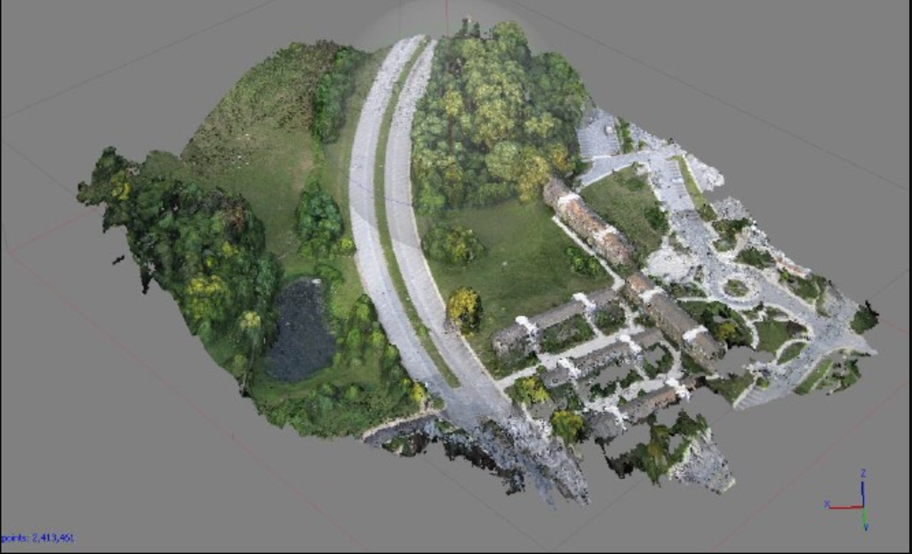

# Dense Clouds 
This map was created by using remote sensing techniques to capture images of the land through the use of weather ballons. A series of photos were taken and compilled into a 3D image of the UMBC campus. 

